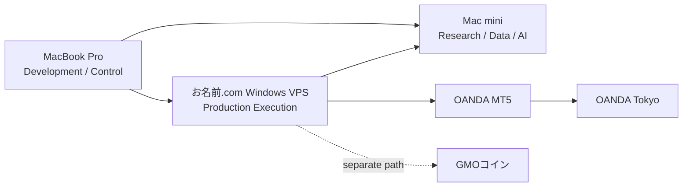

# Aurea Phyllotaxy — AI Engineering Showcase

> Sanitized extract from a private AI-driven research / execution system.

---

## 1. 3-Agent Research

- **Claude** — Primary Analysis / Final Synthesis
- **Codex** — External Public Research
- **Gemini** — Independent Refutation

AI同士の一致をEvidenceにはしません。

詳細: [`research/.claude/skills/ai-research/SKILL.md`](research/.claude/skills/ai-research/SKILL.md)

---

## 2. AI Development Harness

「Promptを工夫する」だけではなく、AIの役割そのものをRepository contractにしています。

例:

- Codexで実装前の横断調査
- Claudeが実装
- Codexが独立評価
- Reviewは実装を変更しない
- Fixは別workflow
- Fix前後で別subagentがmapping / verification / post-scan
- read-only sandbox
- 未走査範囲を成功扱いしない

詳細: [`.claude/skills/`](.claude/skills/)

---

## 3. Real Documentation Structure

Private projectでは、仕様を1枚の巨大文書にまとめていません。

- 正本の責務マップ
- Milestone / Gate
- Package Responsibility
- Verification Contract
- HANDOFF

を分離しています。

入口:

- [`docs/basic/基本ドキュメント_概要マップ.md`](docs/basic/基本ドキュメント_概要マップ.md)
- [`docs/milestones.md`](docs/milestones.md)
- [`docs/sections/共通設計_リポジトリ構成.md`](docs/sections/共通設計_リポジトリ構成.md)
- [`docs/verification_system.md`](docs/verification_system.md)
- [`docs/handoff/HANDOFF.md`](docs/handoff/HANDOFF.md)

---

## 4. Strategy Cartridge

Current private `main` では、CandidateごとのStrategy declarationをRevenue本体から分離するStrategy Cartridge layerも実装しています。

```text
Candidate
   ↓
Immutable Declaration
   ↓
Validation
   ├── Research / Shadow
   └── Demo Execution
           ↓
   Adopted candidate only
           ↓
    Formal Git Config
```

Cartridgeは任意Python pluginではなく、登録済みStrategy Engineへ渡す宣言とfingerprint / validationを持つ層です。

---

## 5. Research / Execution Boundary

```text
開発機
Development / Control
        │
        ▼
専用機
Research / Data / AI / Dashboard
        │
        │ read-only replication
        ▼
Windows VPS
Production Execution / Audit
```

AI能力を増やすことと、AI権限を増やすことを分けています。

---

## Overall Architecture

詳細図: [`docs/architecture/overall_architecture.md`](docs/architecture/overall_architecture.md)


