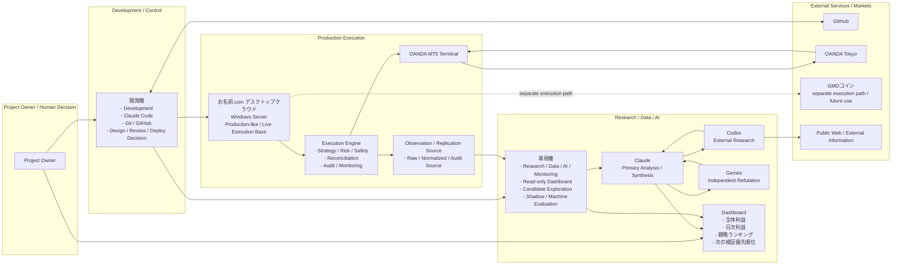
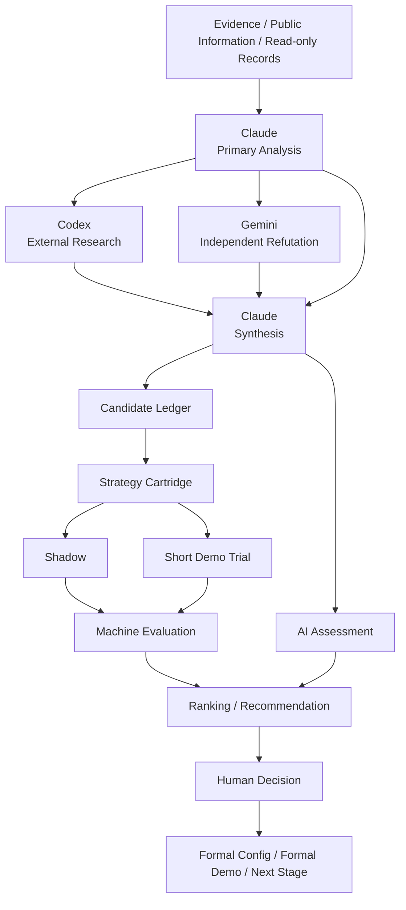

# Overall Architecture

> Aurea Phyllotaxy / Revenue system の全体構造  
> GitHub上では Mermaid 図として表示される。

```mermaid
flowchart LR
    %% =========================
    %% Human / Control Layer
    %% =========================
    subgraph H["Project Owner / Human Decision"]
        U["Project Owner"]
    end

    subgraph DEV["Development / Control"]
        MBP["開発機<br/>- Development<br/>- Claude Code<br/>- Git / GitHub<br/>- Design / Review / Deploy Decision"]
    end

    %% =========================
    %% Research Layer
    %% =========================
    subgraph RES["Research / Data / AI"]
        MINI["専用機<br/>- Research / Data / AI / Monitoring<br/>- Read-only Dashboard<br/>- Candidate Exploration<br/>- Shadow / Machine Evaluation"]
        CLAUDE["Claude<br/>Primary Analysis / Synthesis"]
        CODEX["Codex<br/>External Research"]
        GEMINI["Gemini<br/>Independent Refutation"]
        DASH["Dashboard<br/>- 全体利益<br/>- 日次利益<br/>- 戦略ランキング<br/>- 次の検証優先順位"]
    end

    %% =========================
    %% Production Layer
    %% =========================
    subgraph PROD["Production Execution"]
        VPS["お名前.com デスクトップクラウド<br/>Windows Server<br/>Production-like / Live Execution Base"]
        MT5["OANDA MT5 Terminal"]
        EXEC["Execution Engine<br/>- Strategy / Risk / Safety<br/>- Reconciliation<br/>- Audit / Monitoring"]
        OBS["Observation / Replication Source<br/>- Raw / Normalized / Audit Source"]
    end

    %% =========================
    %% External Services
    %% =========================
    subgraph EXT["External Services / Markets"]
        GH["GitHub"]
        OANDA["OANDA Tokyo"]
        GMO["GMOコイン<br/>separate execution path / future use"]
        WEB["Public Web / External Information"]
    end

    %% =========================
    %% Human interaction
    %% =========================
    U --> MBP
    U --> DASH

    %% =========================
    %% Dev / repo flow
    %% =========================
    MBP <--> GH
    MBP --> MINI
    MBP --> VPS

    %% =========================
    %% AI Research flow
    %% =========================
    MINI --> CLAUDE
    CLAUDE --> CODEX
    CLAUDE --> GEMINI
    CODEX --> WEB
    CLAUDE --> DASH
    CODEX --> CLAUDE
    GEMINI --> CLAUDE

    %% =========================
    %% Research data flow
    %% =========================
    OBS --> MINI
    MINI --> DASH

    %% =========================
    %% Production execution flow
    %% =========================
    VPS --> EXEC
    EXEC --> MT5
    MT5 --> OANDA
    OANDA --> MT5
    EXEC --> OBS

    %% =========================
    %% Separate future/parallel venue
    %% =========================
    VPS -. separate execution path .-> GMO
```

# Research and Evaluation Flow

```mermaid
flowchart TD
    E["Evidence / Public Information / Read-only Records"]
    C1["Claude<br/>Primary Analysis"]
    CX["Codex<br/>External Research"]
    G["Gemini<br/>Independent Refutation"]
    S["Claude<br/>Synthesis"]
    CAND["Candidate Ledger"]
    CART["Strategy Cartridge"]
    SH["Shadow"]
    TR["Short Demo Trial"]
    ME["Machine Evaluation"]
    AIA["AI Assessment"]
    RANK["Ranking / Recommendation"]
    HD["Human Decision"]
    FORMAL["Formal Config / Formal Demo / Next Stage"]

    E --> C1
    C1 --> CX
    C1 --> G
    CX --> S
    G --> S
    C1 --> S
    S --> CAND
    CAND --> CART
    CART --> SH
    CART --> TR
    SH --> ME
    TR --> ME
    S --> AIA
    ME --> RANK
    AIA --> RANK
    RANK --> HD
    HD --> FORMAL
```
